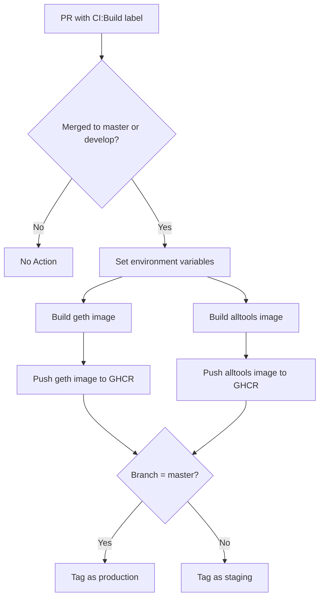
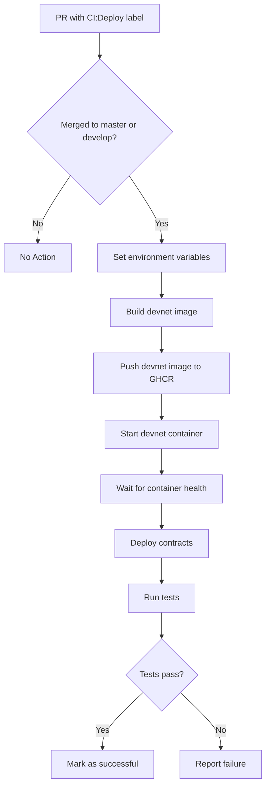
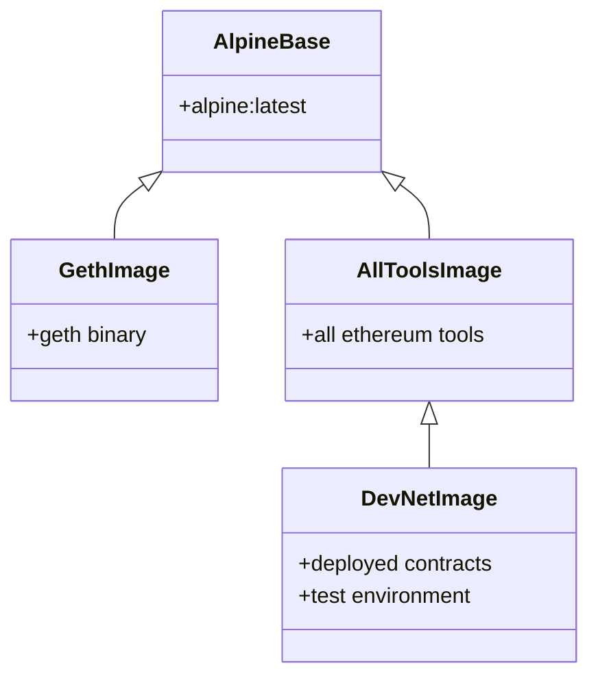
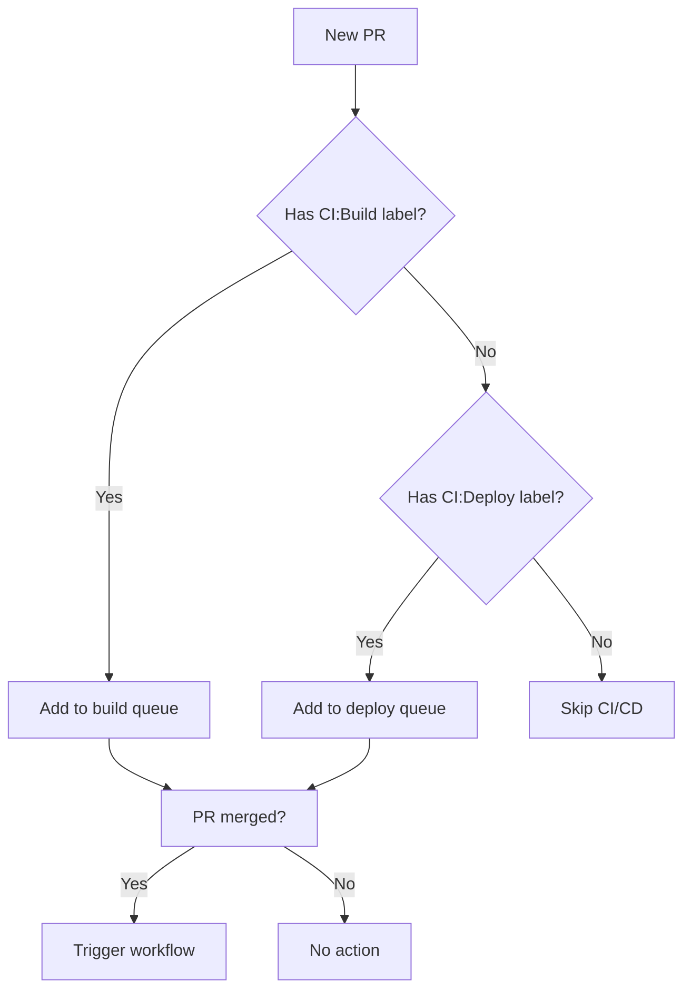
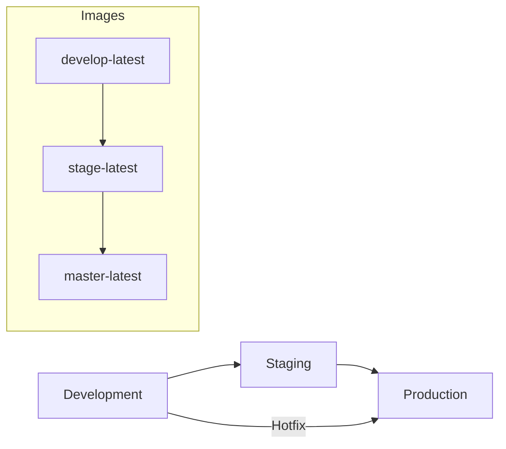
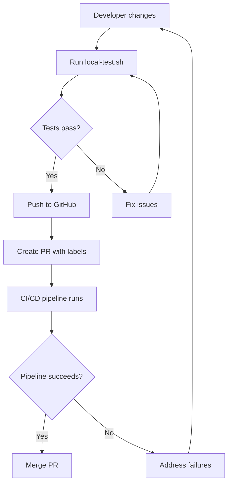
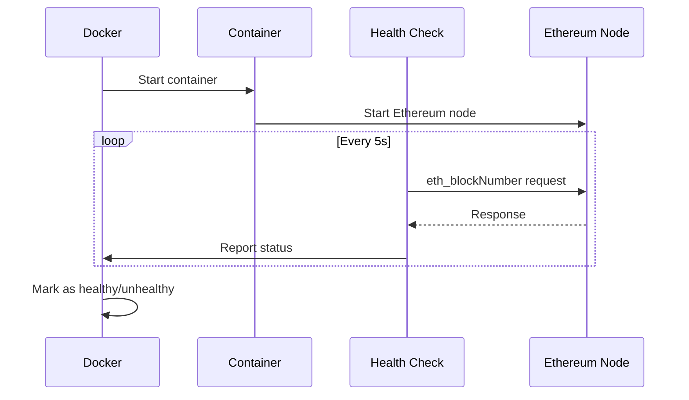
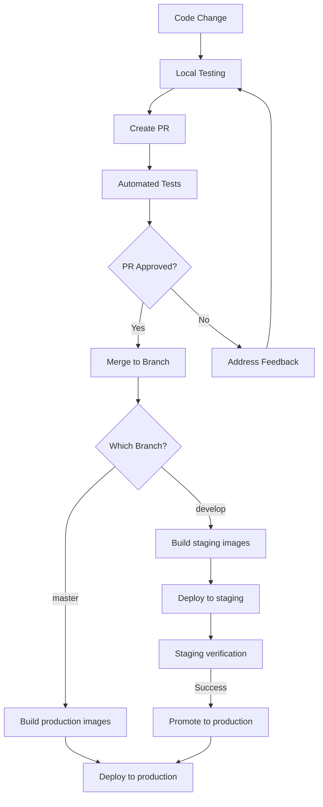
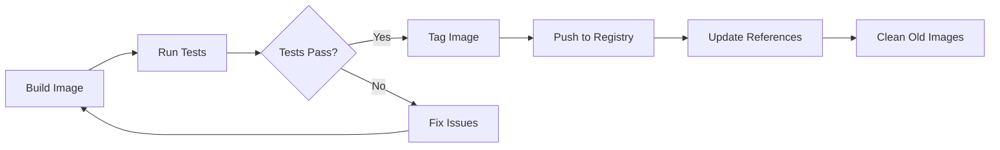

# CI/CD Process Visual Guide

## Overview

This document provides visual representations of the CI/CD processes for the Go Ethereum project, including workflow diagrams, decision trees, and process flows.

## Docker Build Workflow

## DevNet Deployment Workflow

## Image Inheritance Diagram

## Decision Process for CI/CD Triggers

## Environment Promotion Flow

## Local Testing Process

## Container Health Check Sequence

## Complete CI/CD Pipeline

## Docker Image Publication Process

## Reference Documentation

For more detailed information, refer to:
- [README.CI.md](../README.CI.md) - Complete CI/CD documentation
- [IMAGE-MANAGEMENT.md](IMAGE-MANAGEMENT.md) - Docker image management
- [GitHub Actions workflows](../.github/workflows/) - Workflow implementation